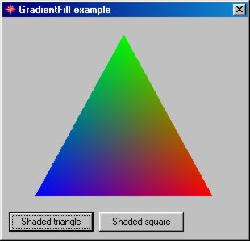



## MSImg32 Usage

### Description

Complete examples about how to use msimg32 library. AlphaBlend, TransparentFill and more...
 
### More Info
 

             |
---                |---
**Submitted On**   |2001-07-23 18:32:04
**By**             |[Daniel Morgato Martin](https://github.com/Planet-Source-Code/PSCIndex/blob/master/ByAuthor/daniel-morgato-martin.md)
**Level**          |Advanced
**User Rating**    |4.8 (19 globes from 4 users)
**Compatibility**  |VB 6\.0
**Category**       |[Graphics](https://github.com/Planet-Source-Code/PSCIndex/blob/master/ByCategory/graphics__1-46.md)
**World**          |[Visual Basic](https://github.com/Planet-Source-Code/PSCIndex/blob/master/ByWorld/visual-basic.md)
**Archive File**   |[MSImg32\_Us507281242002\.zip](https://github.com/Planet-Source-Code/daniel-morgato-martin-msimg32-usage__1-25386/archive/master.zip)

